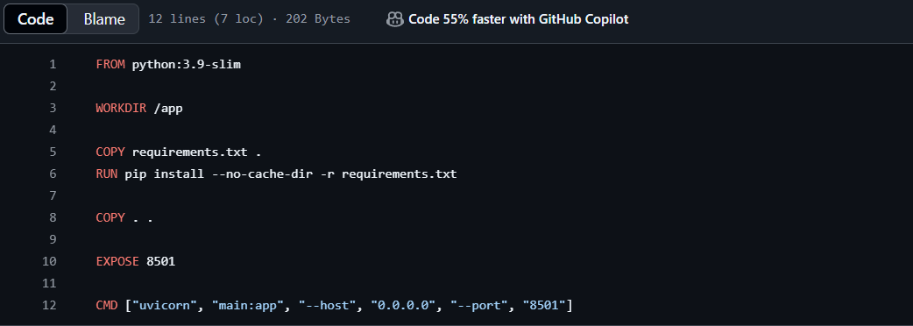

# Int334

Step 1: Creating DockerFile and then Docker image creation and push to Docker hub

Step 2: Creating devepoyment and service yaml file for kubernetes develpyment using NodePort

Step 3: Creating a CI CD pipline through Github Action for Automated docker image creation and devloyment

